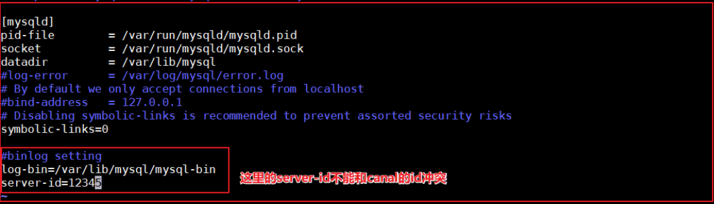
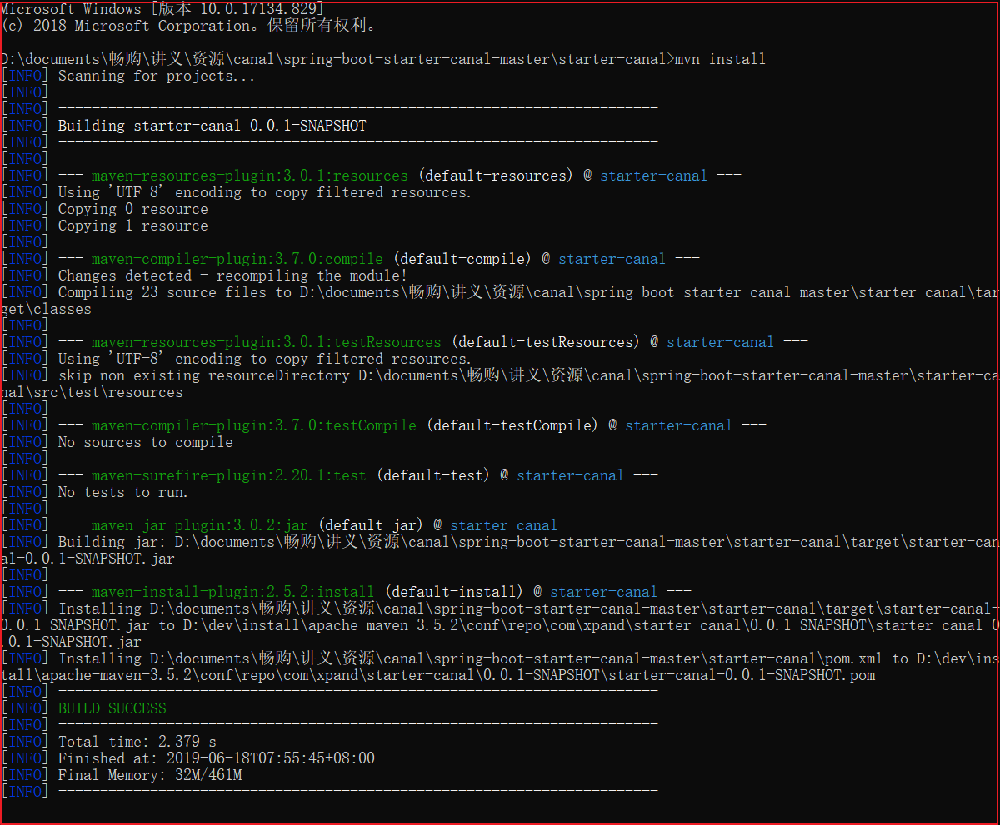

# Canal

canal可以用来监控数据库数据的变化，从而获得新增数据，或者修改的数据。

canal是应阿里巴巴存在杭州和美国的双机房部署，存在跨机房同步的业务需求而提出的。

阿里系公司开始逐步的尝试基于数据库的日志解析，获取增量变更进行同步，由此衍生出了增量订阅&消费的业务。

## 一、Canal工作原理


原理相对比较简单：

1. canal模拟mysql slave的交互协议，伪装自己为mysql slave，向mysql master发送dump协议
2. mysql master收到dump请求，开始推送binary log给slave(也就是canal)
3. canal解析binary log对象(原始为byte流)

canal需要使用到mysql，我们需要先安装mysql,给大家发的虚拟机中已经安装了mysql容器，但canal是基于mysql的主从模式实现的，所以必须先开启binlog.

### 1、开启binlog模式

先使用docker 创建mysql容器,此处不再演示.

(1) 连接到mysql中,并修改/etc/mysql/mysql.conf.d/mysqld.cnf  需要开启主 从模式，开启binlog模式。

执行如下命令，编辑mysql配置文件


命令行如下：

```properties
docker exec -it mysql /bin/bash
cd /etc/mysql/mysql.conf.d
vi mysqld.cnf
```

修改mysqld.cnf配置文件，添加如下配置：



上图配置如下：

```properties
log-bin/var/lib/mysql/mysql-bin
server-id=12345
```

(2) 创建账号 用于测试使用,

使用root账号创建用户并授予权限

```properties
create user canal@'%' IDENTIFIED by 'canal';
GRANT SELECT, REPLICATION SLAVE, REPLICATION CLIENT,SUPER ON *.* TO 'canal'@'%';
FLUSH PRIVILEGES;
```

(3)重启mysql容器

```properties
docker restart mysql
```

(4)进入mysql容器binlog是否开启

```mysql
mysql> show variables like 'log_bin';
+---------------+-------+
| Variable_name | Value |
+---------------+-------+
| log_bin       | ON    |
+---------------+-------+
1 row in set (0.00 sec)
```

### 2、canal容器安装

下载镜像：

```properties
docker pull docker.io/canal/canal-server
```

容器安装

```properties
docker run -p 11111:11111 --name canal -d docker.io/canal/canal-server
```

进入容器,修改核心配置canal.properties 和instance.properties，canal.properties 是canal自身的配置，instance.properties是需要同步数据的数据库连接配置。

执行代码如下:

```properties
docker exec -it canal /bin/bash
cd canal-server/conf/
vi canal.properties
cd example/
vi instance.properties
```

修改canal.properties的id，不能和mysql的server-id重复，如下图：


修改instance.properties,配置数据库连接地址:


这里的`canal.instance.filter.regex`有多种配置，如下：

可以参考地址如下:

```
https://github.com/alibaba/canal/wiki/AdminGuide
```

```properties
mysql 数据解析关注的表，Perl正则表达式.
多个正则之间以逗号(,)分隔，转义符需要双斜杠(\\) 
常见例子：
1.  所有表：.*   or  .*\\..*
2.  canal schema下所有表： canal\\..*
3.  canal下的以canal打头的表：canal\\.canal.*
4.  canal schema下的一张表：canal.test1
5.  多个规则组合使用：canal\\..*,mysql.test1,mysql.test2 (逗号分隔)
注意：此过滤条件只针对row模式的数据有效(ps. mixed/statement因为不解析sql，所以无法准确提取tableName进行过滤)
```

配置完成后，设置开机启动，并记得重启canal。

```properties
docker update --restart=always canal
docker restart canal
```

### 3、canal微服务搭建

 当用户执行 数据库的操作的时候，binlog 日志会被canal捕获到，并解析出数据。我们就可以将解析出来的数据进行同步到redis中即可。

思路：创建一个独立的程序，并监控canal服务器，获取binlog日志，解析数据，将数据更新到redis中。这样广告的数据就更新了。

(1)安装辅助jar包

在`canal\spring-boot-starter-canal-master`中有一个工程`starter-canal`，它主要提供了SpringBoot环境下`canal`的支持，我们需要先安装该工程，在`starter-canal`目录下执行`mvn install`，如下图：



(2)canal微服务工程搭建

在changgou-service下创建changgou-service-canal工程，并引入相关配置。

pom.xml

```xml
<?xml version="1.0" encoding="UTF-8"?>
<project xmlns="http://maven.apache.org/POM/4.0.0"
         xmlns:xsi="http://www.w3.org/2001/XMLSchema-instance"
         xsi:schemaLocation="http://maven.apache.org/POM/4.0.0 http://maven.apache.org/xsd/maven-4.0.0.xsd">
    <parent>
        <artifactId>changgou-service</artifactId>
        <groupId>com.changgou</groupId>
        <version>1.0-SNAPSHOT</version>
    </parent>
    <modelVersion>4.0.0</modelVersion>
    <artifactId>changgou-service-canal</artifactId>

    <dependencies>
        <dependency>
            <groupId>org.springframework.boot</groupId>
            <artifactId>spring-boot-starter</artifactId>
        </dependency>

        <!--canal依赖-->
        <dependency>
            <groupId>com.xpand</groupId>
            <artifactId>starter-canal</artifactId>
            <version>0.0.1-SNAPSHOT</version>
        </dependency>
    </dependencies>
</project>
```

application.yml配置

```properties
server:
  port: 18083
spring:
  application:
    name: canal
eureka:
  client:
    service-url:
      defaultZone: http://127.0.0.1:7001/eureka
  instance:
    prefer-ip-address: true
feign:
  hystrix:
    enabled: true
#hystrix 配置
hystrix:
  command:
    default:
      execution:
        timeout:
        #如果enabled设置为false，则请求超时交给ribbon控制
          enabled: true
        isolation:
          strategy: SEMAPHORE
#canal配置
canal:
  client:
    instances:
      example:
        host: 192.168.211.132
        port: 11111
```

(3)监听创建

创建一个CanalDataEventListener类，实现对表增删改操作的监听，代码如下：

```java
package com.changgou.canal.listener;

import com.alibaba.otter.canal.protocol.CanalEntry;
import com.xpand.starter.canal.annotation.*;

@CanalEventListener
public class CanalDataEventListener {
    @InsertListenPoint
    public void onEventInsert(CanalEntry.EventType eventType, CanalEntry.RowData rowData){
        for (CanalEntry.Column column : rowData.getAfterColumnsList()) {
            System.out.println("新增后列名：" + column.getName() + "----------变更的数据： " + column.getValue());
        }

    }

    @UpdateListenPoint
    public void onEventUpdate(CanalEntry.EventType eventType, CanalEntry.RowData rowData) {
        for (CanalEntry.Column column : rowData.getBeforeColumnsList()) {
            System.out.println("修改前列名：" + column.getName() + "----------变更的数据： " + column.getValue());
        }

        for (CanalEntry.Column column : rowData.getAfterColumnsList()) {
            System.out.println("修改后列名：" + column.getName() + "----------变更的数据： " + column.getValue());
        }
    }

    /***
     * 删除数据监听
     * @param eventType
     */
    @DeleteListenPoint
    public void onEventDelete(CanalEntry.EventType eventType, CanalEntry.RowData rowData) {
        for (CanalEntry.Column column : rowData.getBeforeColumnsList()) {
            System.out.println("删除前列名： " + column.getName() + "变更的数据" + column.getValue());
        }

    }

    @ListenPoint(destination = "example", // 指定实例的地址
            schema = "changgou_content", // 自定义监控的数据库
            table = {"tb_content_category", "tb_content"}, // 自定义监控的表
            eventType = {CanalEntry.EventType.UPDATE, CanalEntry.EventType.DELETE} // 自定义监控类型
    )
    public void onEventCustomUpdate(CanalEntry.EventType eventType, CanalEntry.RowData rowData){
        for (CanalEntry.Column column : rowData.getBeforeColumnsList()) {
            System.out.println("自定义监控前列名：" + column.getName() + "----------变更的数据： " + column.getValue());
        }

        for (CanalEntry.Column column : rowData.getAfterColumnsList()) {
            System.out.println("自定义监控后列名：" + column.getName() + "----------变更的数据： " + column.getValue());
        }

    }
}
```

(4)启动类创建

在com.changgou中创建启动类，代码如下：

```properties
@SpringBootApplication(exclude={DataSourceAutoConfiguration.class})
@EnableEurekaClient
@EnableCanalClient
public class CanalApplication {

    public static void main(String[] args) {
        SpringApplication.run(CanalApplication.class,args);
    }
}
```

(5)测试

启动canal微服务，然后修改任意数据库的表数据，canal微服务后台输出如下：


