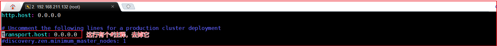
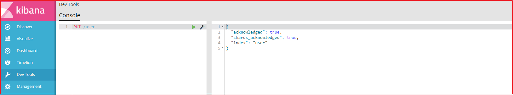
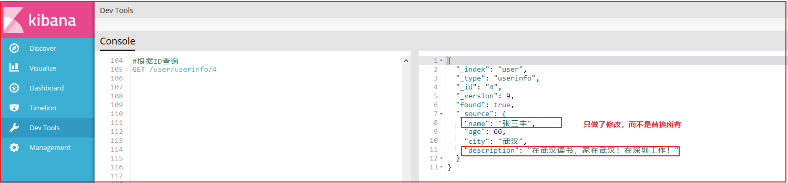
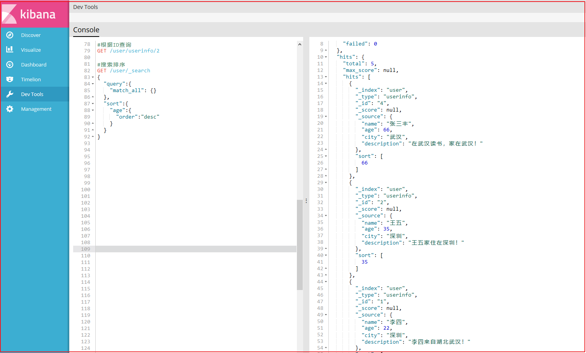
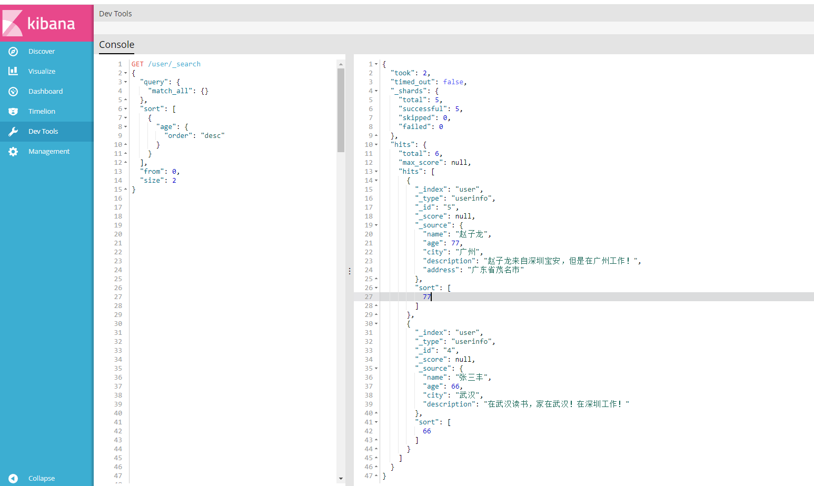
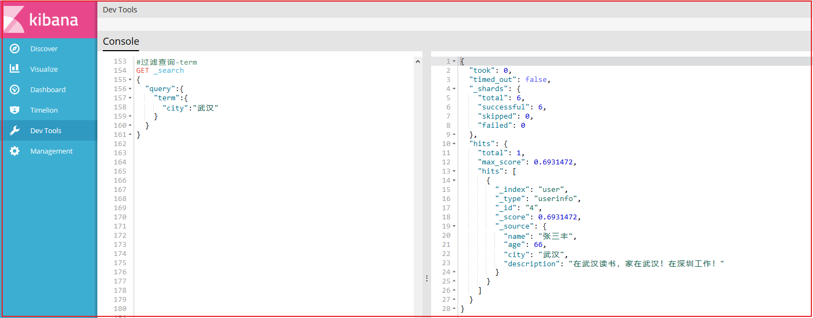
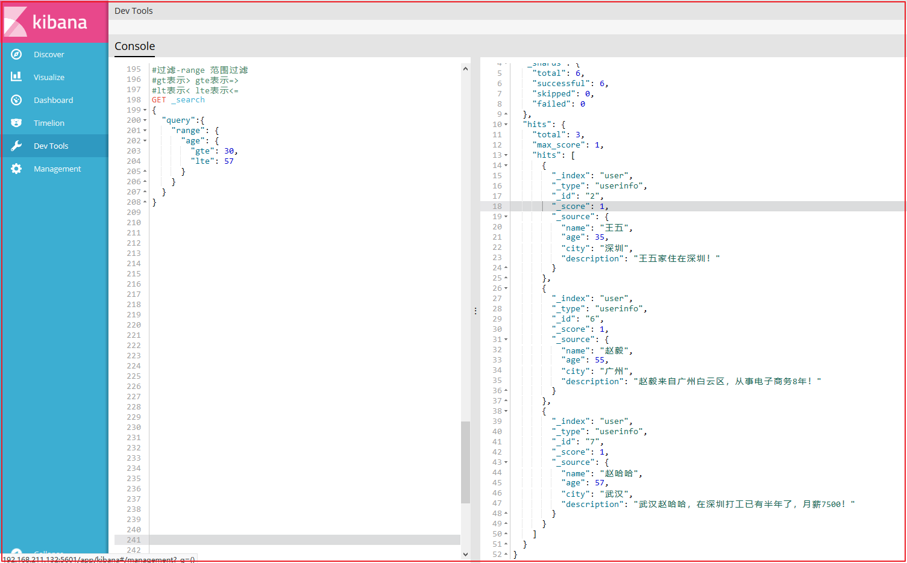
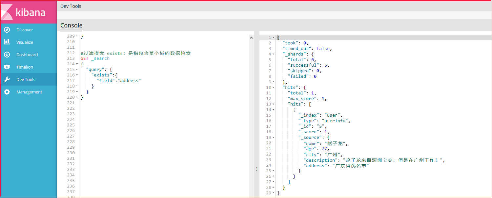

# Elasticsearch

## 一、Elasticsearch 安装 

我们之前已经使用过elasticsearch了，这里不再对它进行介绍了，直接下载安装，本章节将采用Docker安装，不过在市面上还有很多采用linxu安装，关于linux安装，已经提供了安装手册，这里就不讲了。

(1)docker镜像下载

```properties
docker pull elasticsearch:5.6.8
```

注意：由于镜像有570MB，所以提供的虚拟机里已经下载好了该镜像，如下图：


(2)安装es容器

```properties
docker run -di --name=changgou_elasticsearch -p 9200:9200 -p 9300:9300 elasticsearch:5.6.8
```

 9200端口(Web管理平台端口)  9300(服务默认端口)

浏览器输入地址访问：`http://192.168.211.132:9200/`


(3)开启远程连接

上面完成安装后，es并不能正常使用，elasticsearch从5版本以后默认不开启远程连接，程序直接连接会报如下错误：

```java
failed to load elasticsearch nodes : org.elasticsearch.client.transport.NoNodeAvailableException: None of the configured nodes are available: [{#transport#-1}{5ttLpMhkRjKLkvoY7ltUWg}{192.168.211.132}{192.168.211.132:9300}]
```

我们需要修改es配置开启远程连接，代码如下：

登录容器

```properties
docker exec -it changgou_elasticsearch /bin/bash
```

查看目录结构 输入: dir

```properties
root@07f22eb41bb5:/usr/share/elasticsearch# dir
NOTICE.txt  README.textile  bin  config  data  lib  logs  modules  plugins
```

进入config目录

```properties
cd config
```

查看文件

```properties
root@07f22eb41bb5:/usr/share/elasticsearch/config# ls
elasticsearch.yml  log4j2.properties  scripts
```

修改elasticsearch.yml文件

```properties
root@07f22eb41bb5:/usr/share/elasticsearch/config# sed -i '/^#.*transport/s/^#//' elasticsearch.yml
```

修改如下图：



同时添加下面一行代码：

```properties
cluster.name: my-application
```

(4)跨域配置

修改elasticsearch/config下的配置文件：elasticsearch.yml，增加以下三句命令，并重启:

```properties
http.cors.enabled: true
http.cors.allow-origin: "*"
network.host: 192.168.211.132
```

其中：
http.cors.enabled: true：此步为允许elasticsearch跨域访问，默认是false。
http.cors.allow-origin: "*"：表示跨域访问允许的域名地址（*表示任意）。

重启docker

```properties
docker restart changgou_elasticsearch
```

(5)系统参数配置

重启后发现重启启动失败了，这时什么原因呢？这与我们刚才修改的配置有关，因为elasticsearch在启动的时候会进行一些检查，比如最多打开的文件的个数以及虚拟内存区域数量等等，如果你放开了此配置，意味着需要打开更多的文件以及虚拟内存，所以我们还需要系统调优 

修改vi /etc/security/limits.conf ，追加内容 (nofile是单个进程允许打开的最大文件个数 soft nofile 是软限制 hard nofile是硬限制 )

```properties
* soft nofile 65536
* hard nofile 65536
```

修改vi /etc/sysctl.conf，追加内容 (限制一个进程可以拥有的VMA(虚拟内存区域)的数量 )

```properties
vm.max_map_count=655360
```

执行下面命令 修改内核参数马上生效

```properties
sysctl -p
```

重新启动虚拟机，再次启动容器，发现已经可以启动并远程访问 

```properties
reboot
```

小提示：如果想让容器开启重启，可以执行下面命令

```properties
docker update --restart=always 容器名称或者容器id
```

## 二、IK分词器安装 

(1)安装ik分词器

IK分词器下载地址https://github.com/medcl/elasticsearch-analysis-ik/releases

将ik分词器上传到服务器上，然后解压，并改名字为ik

```properties
unzip elasticsearch-analysis-ik-5.6.8.zip
mv elasticsearch ik
```

将ik目录拷贝到docker容器的plugins目录下

```properties
docker cp ./ik changgou_elasticsearch:/usr/share/elasticsearch/plugins
```

(2)IK分词器测试

访问：`http://192.168.211.132:9200/_analyze?analyzer=ik_smart&pretty=true&text=我是程序员`


访问：`http://192.168.211.132:9200/_analyze?analyzer=ik_max_word&pretty=true&text=我是程序员`


## 三、Kibana使用-掌握DSL语句

我们上面使用的是elasticsearch-head插件实现数据查找的，但是elasticsearch-head的功能比较单一，我们这里需要一个更专业的工具实现对日志的实时分析，也就是我们接下来要讲的kibana。

Kibana 是一款开源的数据分析和可视化平台，它是 Elastic Stack 成员之一，设计用于和 Elasticsearch 协作。您可以使用 Kibana 对 Elasticsearch 索引中的数据进行搜索、查看、交互操作。您可以很方便的利用图表、表格及地图对数据进行多元化的分析和呈现。

Kibana 可以使大数据通俗易懂。它很简单，基于浏览器的界面便于您快速创建和分享动态数据仪表板来追踪 Elasticsearch 的实时数据变化。

搭建 Kibana 非常简单。您可以分分钟完成 Kibana 的安装并开始探索 Elasticsearch 的索引数据 — 没有代码、不需要额外的基础设施。

### 3.1、 Kibana下载安装

我们项目中不再使用linux，直接使用Docker，所有这里就不演示在windows的下载安装了。

(1)镜像下载

```properties
docker pull docker.io/kibana:5.6.8
```

为了节省时间，虚拟机中已经存在该版本的镜像了.

(2)安装kibana容器

执行如下命令，开始安装kibana容器

```properties
docker run -it -d -e ELASTICSEARCH_URL=http://192.168.211.132:9200 --name kibana --restart=always -p 5601:5601 kibana:5.6.8
```

ELASTICSEARCH_URL=http://192.168.211.132:9200：是指链接的ES地址

restart=always:每次服务都会重启，也就是开启启动

5601:5601:端口号

(3)访问测试

访问`http://192.168.211.132:5601`如下：


### 2.2、Kibana使用

#### 3.2.1 配置索引

要使用Kibana，您必须至少配置一个索引。索引用于标识Elasticsearch索引以运行搜索和分析。它们还用于配置字段。 


我们修改索引名称的匹配方式即可，下面2个选项不用勾选。点击create，会展示出当前配置的索引的域信息，如下图：


域的每个标题选项分别代表如下意思：


#### 3.2.2 数据搜索

Discover为数据搜索部分，可以对日志信息进行搜索操作。


可以使用Discover实现数据搜索过滤和搜索条件显示以及关键词搜索，如下图：


#### 3.2.3 DSL语句使用

##### 3.2.3.1 Query DSL结构化查询介绍

Query DSL是一个Java开源框架用于构建类型安全的SQL查询语句。采用API代替传统的拼接字符串来构造查询语句。目前Querydsl支持的平台包括JPA,JDO，SQL，Java Collections，RDF，Lucene，Hibernate Search。elasticsearch提供了一整套基于JSON的查询DSL语言来定义查询。
Query DSL当作是一系列的抽象的查询表达式树(AST)特定查询能够包含其它的查询，(如 bool ), 有些查询能够包含过滤器(如 constant_score), 还有的可以同时包含查询和过滤器 (如 filtered). 都能够从ES支持查询集合里面选择任意一个查询或者是从过滤器集合里面挑选出任意一个过滤器, 这样的话，我们就可以构造出任意复杂（maybe 非常有趣）的查询了。


##### 3.2.3.2 索引操作

(1)查询所有索引

```properties
GET /_cat/indices?v
```

结果如下：


(2)删除某个索引

```properties
DELETE /skuinfo
```

效果如下：


(3)新增索引

```properties
PUT /user
```

效果如下：




(4)创建映射

```properties
PUT /user/userinfo/_mapping
{
  "properties": {
    "name":{
      "type": "text",
      "analyzer": "ik_smart",
      "search_analyzer": "ik_smart",
      "store": false
    },
    "city":{
      "type": "text",
      "analyzer": "ik_smart",
      "search_analyzer": "ik_smart",
      "store": false
    },
    "age":{
      "type": "long",
      "store": false
    },
    "description":{
      "type": "text",
      "analyzer": "ik_smart",
      "search_analyzer": "ik_smart",
      "store": false
    }
  }
}
```

效果如下：


(5)新增文档数据

```properties
PUT /user/userinfo/1
{
  "name":"李四",
  "age":22,
  "city":"深圳",
  "description":"李四来自湖北武汉！"
}
```

效果如下：


我们再增加3条记录：

```properties
#新增文档数据 id=2
PUT /user/userinfo/2
{
  "name":"王五",
  "age":35,
  "city":"深圳",
  "description":"王五家住在深圳！"
}

#新增文档数据 id=3
PUT /user/userinfo/3
{
  "name":"张三",
  "age":19,
  "city":"深圳",
  "description":"在深圳打工，来自湖北武汉"
}

#新增文档数据 id=4
PUT /user/userinfo/4
{
  "name":"张三丰",
  "age":66,
  "city":"武汉",
  "description":"在武汉读书，家在武汉！"
}

#新增文档数据 id=5
PUT /user/userinfo/5
{
  "name":"赵子龙",
  "age":77,
  "city":"广州",
  "description":"赵子龙来自深圳宝安，但是在广州工作！",
  "address":"广东省茂名市"
}

#新增文档数据 id=6
PUT /user/userinfo/6
{
  "name":"赵毅",
  "age":55,
  "city":"广州",
  "description":"赵毅来自广州白云区，从事电子商务8年！"
}

#新增文档数据 id=7
PUT /user/userinfo/7
{
  "name":"赵哈哈",
  "age":57,
  "city":"武汉",
  "description":"武汉赵哈哈，在深圳打工已有半年了，月薪7500！"
}
```


(6)修改数据

**a.替换操作**

更新数据可以使用之前的增加操作,这种操作会将整个数据替换掉，代码如下：

```properties
#更新数据,id=4
PUT /user/userinfo/4
{
  "name":"张三丰",
  "description":"在武汉读书，家在武汉！在深圳工作！"
}
```

效果如下：


使用GET命令查看：

```properties
#根据ID查询
GET /user/userinfo/4
```

效果如下：


**b.更新操作**

我们先使用下面命令恢复数据：

```properties
#恢复文档数据 id=4
PUT /user/userinfo/4
{
  "name":"张三丰",
  "age":66,
  "city":"武汉",
  "description":"在武汉读书，家在武汉！"
}
```

使用POST更新某个列的数据

```properties
#使用POST更新某个域的数据
POST /user/userinfo/4/_update
{
  "doc":{
    "name":"张三丰",
    "description":"在武汉读书，家在武汉！在深圳工作！"
  }
}
```

效果如下：


使用GET命令查看：

```properties
#根据ID查询
GET /user/userinfo/4
```

效果如下：




(7)删除Document

```properties
#删除数据
DELETE user/userinfo/7
```


##### 3.2.3.3 数据查询

(1)查询所有数据

```properties
#查询所有
GET /user/_search
```

效果如下：


(2)根据ID查询

```properties
#根据ID查询
GET /user/userinfo/2
```

效果如下：


(3)Sort排序

```properties
#搜索排序
GET /user/_search
{
  "query":{
    "match_all": {}
  },
  "sort":{
    "age":{
      "order":"desc"
    }
  }
}
```

效果如下：




(4)分页

```json
GET /user/_search
{
  "query": {
    "match_all": {}
  },
  "sort": [
    {
      "age": {
        "order": "desc"
      }
    }
  ],
  "from": 0,
  "size": 2
}
```

解释：

from:从下N的记录开始查询

size:每页显示条数

效果如下：



##### 3.2.3.4 过滤查询

(1)term过滤

term主要用于分词精确匹配，如字符串、数值、日期等（不适合情况：1.列中除英文字符外有其它值 2.字符串值中有冒号或中文 3.系统自带属性如_version） 

如下案例：

```json
#过滤查询-term
GET _search
{
  "query":{
    "term":{
      "city":"武汉"
    }
  }
}
```

效果如下：




(2)terms 过滤

terms 跟 term 有点类似，但 terms 允许指定多个匹配条件。 如果某个字段指定了多个值，那么文档需要一起去做匹配 。

案例如下：

```json
#过滤查询-terms 允许多个Term
GET _search
{
  "query":{
    "terms":{
      "city":
        [
          "武汉",
          "广州"
        ]
    }
  }
}
```

果如下：


(3) range 过滤

range过滤允许我们按照指定范围查找一批数据。例如我们查询年龄范围

案例如下：

```json
#过滤-range 范围过滤
#gt表示> gte表示=>
#lt表示< lte表示<=
GET _search
{
  "query":{
    "range": {
      "age": {
        "gte": 30,
        "lte": 57
      }
    }
  }
}
```

上图效果如下：




(4)exists过滤

exists 过滤可以用于查找拥有某个域的数据 

案例如下：

```json
#过滤搜索 exists：是指包含某个域的数据检索
GET _search
{
  "query": {
    "exists":{
      "field":"address"
    }
  }
}
```

效果如下：




(5) bool 过滤

bool 过滤可以用来合并多个过滤条件查询结果的布尔逻辑，它包含一下操作符：

- must : 多个查询条件的完全匹配,相当于 and。
- must_not : 多个查询条件的相反匹配，相当于 not。
- should : 至少有一个查询条件匹配, 相当于 or。

这些参数可以分别继承一个过滤条件或者一个过滤条件的数组：

案例如下：

```json
#过滤搜索 bool 
#must : 多个查询条件的完全匹配,相当于 and。
#must_not : 多个查询条件的相反匹配，相当于 not。
#should : 至少有一个查询条件匹配, 相当于 or。
GET _search
{
  "query": {
    "bool": {
      "must": [
        {
          "term": {
            "city": {
              "value": "深圳"
            }
          }
        },
        {
          "range":{
            "age":{
              "gte":20,
              "lte":99
            }
          }
        }
      ]
    }
  }
}
```

效果如下：


(6) match_all 查询

可以查询到所有文档，是没有查询条件下的默认语句。 

案例如下：

```json
#查询所有 match_all
GET _search
{
  "query": {
    "match_all": {}
  }
}
```

(7) match 查询

match查询是一个标准查询，不管你需要全文本查询还是精确查询基本上都要用到它。

如果你使用 match 查询一个全文本字段，它会在真正查询之前用分析器先分析match一下查询字符：

案例如下：

```json
#字符串匹配
GET _search
{
  "query": {
    "match": {
      "description": "武汉"
    }
  }
}
```

效果如下：


(8)prefix 查询

以什么字符开头的，可以更简单地用 prefix ,例如查询所有以张开始的用户描述

案例如下：

```properties
#前缀匹配 prefix
GET _search
{
  "query": {
    "prefix": {
      "name": {
        "value": "赵"
      }
    }
  }
}
```

效果如下：


(9)multi_match 查询

multi_match查询允许你做match查询的基础上同时搜索多个字段，在多个字段中同时查一个 

案例如下：

```json
#多个域匹配搜索
GET _search
{
  "query": {
    "multi_match": {
      "query": "深圳",
      "fields": [
        "city",
        "description"
      ]
    }
  }
}
```

效果如下：


##### 3.2.3.5 完整DSL语句代码

```properties
#查看所有索引
GET /_cat/indices?v

#删除某个索引
DELETE /skuinfo

#新增索引
PUT /user

#创建映射
PUT /user/userinfo/_mapping
{
  "properties": {
    "name":{
      "type": "text",
      "analyzer": "ik_smart",
      "search_analyzer": "ik_smart",
      "store": false
    },
    "city":{
      "type": "text",
      "analyzer": "ik_smart",
      "search_analyzer": "ik_smart",
      "store": false
    },
    "age":{
      "type": "long",
      "store": false
    },
    "description":{
      "type": "text",
      "analyzer": "ik_smart",
      "search_analyzer": "ik_smart",
      "store": false
    }
  }
}

#新增文档数据 id=1
PUT /user/userinfo/1
{
  "name":"李四",
  "age":22,
  "city":"深圳",
  "description":"李四来自湖北武汉！"
}

#新增文档数据 id=2
PUT /user/userinfo/2
{
  "name":"王五",
  "age":35,
  "city":"深圳",
  "description":"王五家住在深圳！"
}

#新增文档数据 id=3
PUT /user/userinfo/3
{
  "name":"张三",
  "age":19,
  "city":"深圳",
  "description":"在深圳打工，来自湖北武汉"
}

#新增文档数据 id=4
PUT /user/userinfo/4
{
  "name":"张三丰",
  "age":66,
  "city":"武汉",
  "description":"在武汉读书，家在武汉！"
}

#新增文档数据 id=5
PUT /user/userinfo/5
{
  "name":"赵子龙",
  "age":77,
  "city":"广州",
  "description":"赵子龙来自深圳宝安，但是在广州工作！",
  "address":"广东省茂名市"
}

#新增文档数据 id=6
PUT /user/userinfo/6
{
  "name":"赵毅",
  "age":55,
  "city":"广州",
  "description":"赵毅来自广州白云区，从事电子商务8年！"
}

#新增文档数据 id=7
PUT /user/userinfo/7
{
  "name":"赵哈哈",
  "age":57,
  "city":"武汉",
  "description":"武汉赵哈哈，在深圳打工已有半年了，月薪7500！"
}

#更新数据,id=4
PUT /user/userinfo/4
{
  "name":"张三丰",
  "description":"在武汉读书，家在武汉！在深圳工作！"
}


#根据ID查询
GET /user/userinfo/4

#恢复文档数据 id=4
PUT /user/userinfo/4
{
  "name":"张三丰",
  "age":66,
  "city":"武汉",
  "description":"在武汉读书，家在武汉！"
}

#使用POST更新某个域的数据
POST /user/userinfo/4/_update
{
  "doc":{
    "name":"张三丰",
    "description":"在武汉读书，家在武汉！在深圳工作！"
  }
}

#根据ID查询
GET /user/userinfo/4

#删除数据
DELETE user/userinfo/4

#查询所有
GET /user/_search

#根据ID查询
GET /user/userinfo/2

#搜索排序
GET /user/_search
{
  "query":{
    "match_all": {}
  },
  "sort":{
    "age":{
      "order":"desc"
    }
  }
}

#分页实现
GET /user/_search
{
  "query":{
    "match_all": {}
  },
  "sort":{
    "age":{
      "order":"desc"
    }
  },
  "from": 0,
  "size": 2
}

#过滤查询-term
GET _search
{
  "query":{
    "term":{
      "city":"武汉"
    }
  }
}

#过滤查询-terms 允许多个Term
GET _search
{
  "query":{
    "terms":{
      "city":
        [
          "武汉",
          "广州"
        ]
    }
  }
}

#过滤-range 范围过滤
#gt表示> gte表示=>
#lt表示< lte表示<=
GET _search
{
  "query":{
    "range": {
      "age": {
        "gte": 30,
        "lte": 57
      }
    }
  }
}


#过滤搜索 exists：是指包含某个域的数据检索
GET _search
{
  "query": {
    "exists":{
      "field":"address"
    }
  }
}

#过滤搜索 bool 
#must : 多个查询条件的完全匹配,相当于 and。
#must_not : 多个查询条件的相反匹配，相当于 not。
#should : 至少有一个查询条件匹配, 相当于 or。
GET _search
{
  "query": {
    "bool": {
      "must": [
        {
          "term": {
            "city": {
              "value": "深圳"
            }
          }
        },
        {
          "range":{
            "age":{
              "gte":20,
              "lte":99
            }
          }
        }
      ]
    }
  }
}

#查询所有 match_all
GET _search
{
  "query": {
    "match_all": {}
  }
}

#字符串匹配
GET _search
{
  "query": {
    "match": {
      "description": "武汉"
    }
  }
}

#前缀匹配 prefix
GET _search
{
  "query": {
    "prefix": {
      "name": {
        "value": "赵"
      }
    }
  }
}

#多个域匹配搜索
GET _search
{
  "query": {
    "multi_match": {
      "query": "深圳",
      "fields": [
        "city",
        "description"
      ]
    }
  }
}
```


