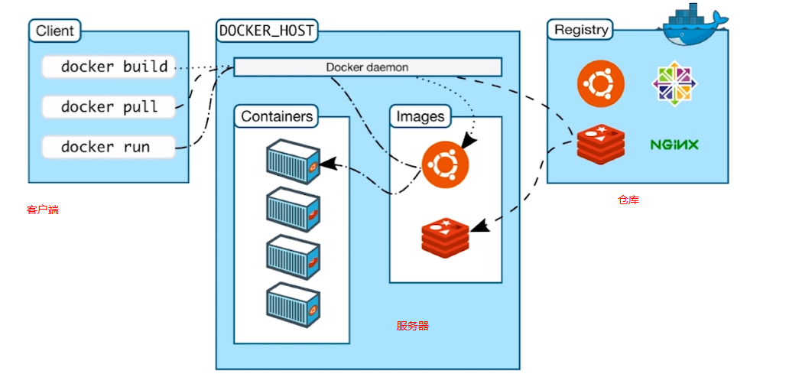
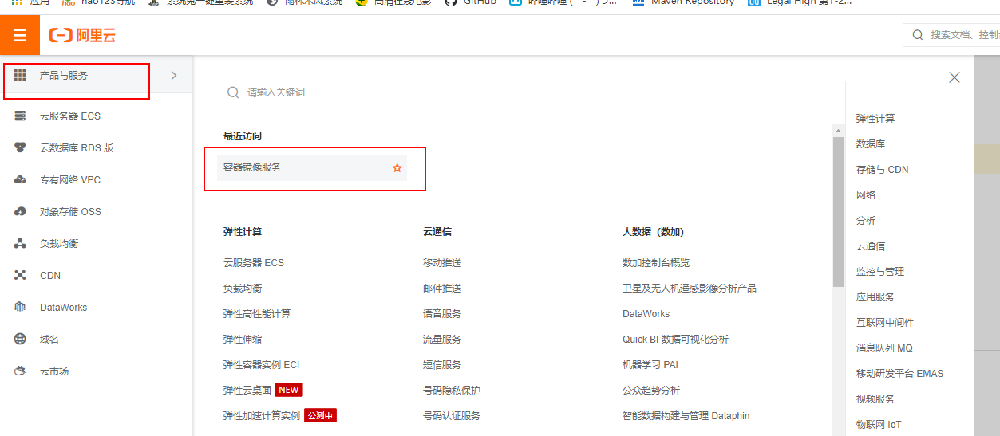
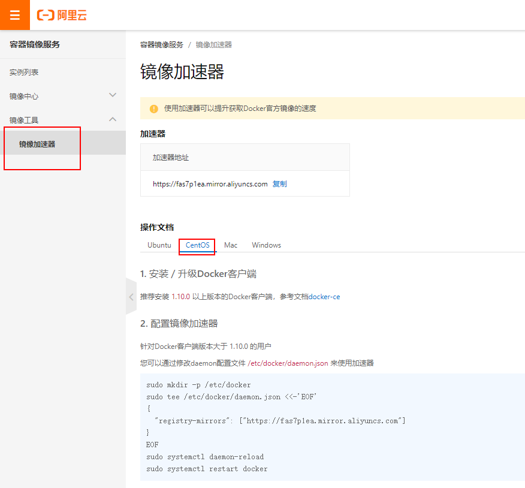
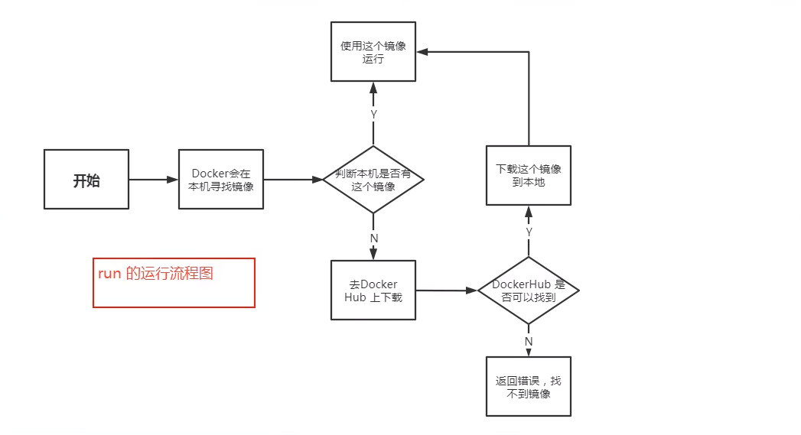

# Docker

## 一、定义

Docker 是一个开源的应用容器引擎，让开发者可以打包他们的应用以及依赖包到一个可移植的镜像中，然后发布到任何流行的 Linux或Windows操作系统的机器上，也可以实现虚拟化。

## 二、架构



## 三、基本组成

+ **镜像**

  docker镜像就好比一个模板，通过这个模板来创建容器服务，一个镜像可以启动多个容器，每个容器都是独立的，互不干扰。

+ **容器**

  独立运行一个或者一组应用

+ **仓库**

  存放镜像的地方

## 四、系统要求

系统 Centos7+ ,  内核 3.10.0 以上

## 五、安装

按官网指导安装：官网安装地址: https://docs.docker.com/engine/install/centos/

```shell
# 1、卸载旧版本
yum remove docker \
    docker-client \
    docker-client-latest \
    docker-common \
    docker-latest \
    docker-latest-logrotate \
    docker-logrotate \
    docker-engine

# 2、安装需要的包
yum install -y yum-utils

# 3、安装国内的镜像仓库
yum-config-manager --add-repo http://mirrors.aliyun.com/docker-ce/linux/centos/docker-ce.repo


# 安装好之后更新索引
yum makecache fast

# 4、安装docker相关 ， docker-ce 社区版本(默认安装最新版本)  docker-ee 企业版
yum install -y docker-ce docker-ce-cli containerd.io docker-buildx-plugin docker-compose-plugin


# 5、启动docer
systemctl start docker

# 使用 docker version判断是否安装成功

[root@changgou ~]# docker version
Client: Docker Engine - Community
 Version:           25.0.1
 API version:       1.44
 Go version:        go1.21.6
 Git commit:        29cf629
 Built:             Tue Jan 23 23:12:51 2024
 OS/Arch:           linux/amd64
 Context:           default

Server: Docker Engine - Community
 Engine:
  Version:          25.0.1
  API version:      1.44 (minimum version 1.24)
  Go version:       go1.21.6
  Git commit:       71fa3ab
  Built:            Tue Jan 23 23:11:50 2024
  OS/Arch:          linux/amd64
  Experimental:     false
 containerd:
  Version:          1.6.27
  GitCommit:        a1496014c916f9e62104b33d1bb5bd03b0858e59
 runc:
  Version:          1.1.11
  GitCommit:        v1.1.11-0-g4bccb38
 docker-init:
  Version:          0.19.0
  GitCommit:        de40ad0
  
# 6、hello-world ， 本地仓库没找到hello-world镜像会自动从远程你仓库下载
[root@changgou ~]# docker run hello-world
Unable to find image 'hello-world:latest' locally
latest: Pulling from library/hello-world
c1ec31eb5944: Pull complete 
Digest: sha256:4bd78111b6914a99dbc560e6a20eab57ff6655aea4a80c50b0c5491968cbc2e6
Status: Downloaded newer image for hello-world:latest

Hello from Docker!
This message shows that your installation appears to be working correctly.

To generate this message, Docker took the following steps:
 1. The Docker client contacted the Docker daemon.
 2. The Docker daemon pulled the "hello-world" image from the Docker Hub.
    (amd64)
 3. The Docker daemon created a new container from that image which runs the
    executable that produces the output you are currently reading.
 4. The Docker daemon streamed that output to the Docker client, which sent it
    to your terminal.

To try something more ambitious, you can run an Ubuntu container with:
 $ docker run -it ubuntu bash

Share images, automate workflows, and more with a free Docker ID:
 https://hub.docker.com/

For more examples and ideas, visit:
 https://docs.docker.com/get-started/
 
# 7、查看下载的helloworld镜像
[root@changgou ~]# docker images
REPOSITORY    TAG       IMAGE ID       CREATED        SIZE
hello-world   latest    d2c94e258dcb   9 months ago   13.3kB

# 8、卸载docker（了解）
# 卸载依赖
yum remove docker-ce docker-ce-cli containerd.io docker-buildx-plugin docker-compose-plugin docker-ce-rootless-extras
# 删除资源
rm -rf /var/lib/docker
rm -rf /var/lib/containerd

# /var/lib/docker docker的默认工作路径
```

## 六、配置docker阿里云加速器

### 1、加速器地址

https://cr.console.aliyun.com/cn-hangzhou/instances/mirrors





### 2、配置使用

```shell
# 2024年6月份dockerhub被墙了，替换方案： https://www.bilibili.com/video/BV1w4421X7jE/?spm_id_from=333.337.search-card.all.click&vd_source=165a812497dd3d7dfba718ae4ef14867

# ---------------------------------------------略---------------------------------------------
# 按照上图第二步配置镜像加速器操作
#1、新建一个目录
[root@node01 ~]# mkdir -p /etc/docker

#2、配置一个阿里去的加速器地址，这个地址要注册账号之后才会有
[root@node01 ~]# tee /etc/docker/daemon.json <<-'EOF'
> {
>   "registry-mirrors": ["https://fas7p1ea.mirror.aliyuncs.com"]
> }
> EOF
{
    "registry-mirrors": ["https://fas7p1ea.mirror.aliyuncs.com"]
}
EOF

# 3、重启服务
[root@node01 ~]# systemctl daemon-reload
[root@node01 ~]# systemctl restart docker
```

## 七、回顾docker run 流程



## 八、设置docker 开机启动

```shell
[root@changgou ~]# systemctl enable docker
Created symlink from /etc/systemd/system/multi-user.target.wants/docker.service to /usr/lib/systemd/system/docker.service.
```

