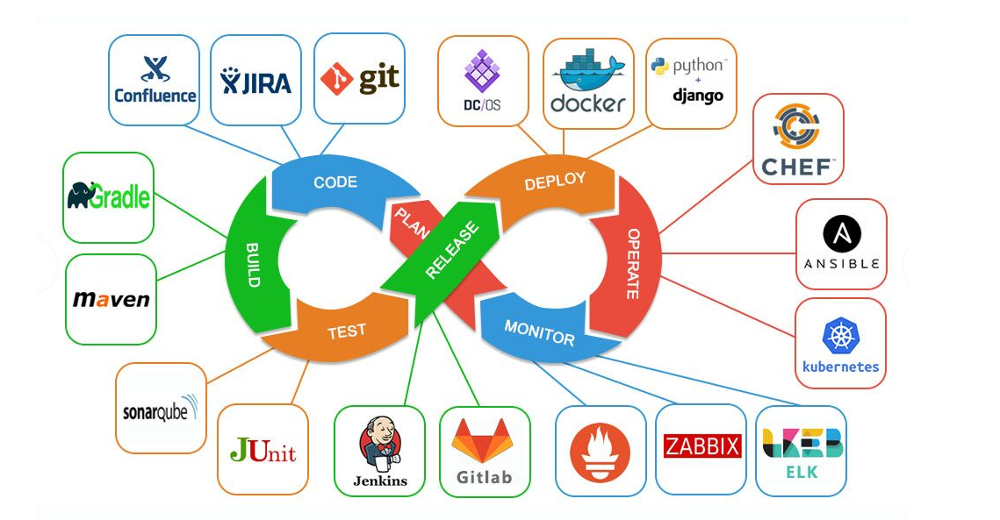
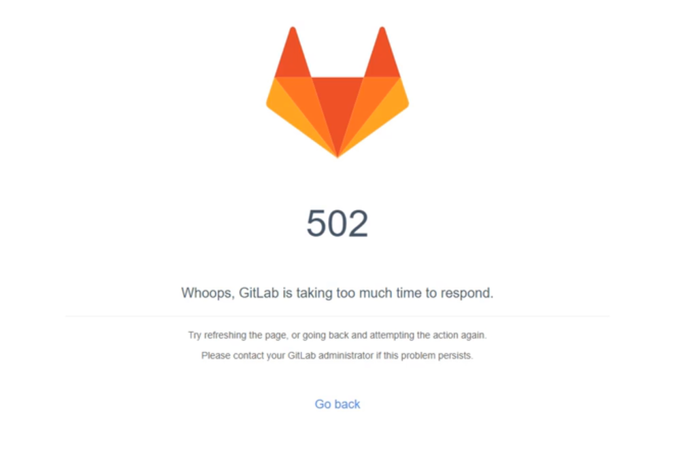

# DevOps

## 一、DevOps介绍 

软件开发开始是由两个团队组成：

- 开发计划由开发团队从头开始设计和整体系统的构建。需要系统不停的迭代更新。 
- 运维团队将开发团队的Code进行测试后部署上线。希望系统稳定安全运行。

这看似两个目标不同的团队需要协同完成一个软件的开发。

在开发团队指定好计划并完成coding后，需要提供到运维团队。

运维团队向开发团队反馈需要修复的BUG以及一些需要返工的任务。

这时开发团队需要经常等待运维团队的反馈。这无疑延长了事件并推迟了整个软件开发的周期。

会有一种方式，在开发团队等待的时候，让开发团队转移到下一个项目中。等待运维团队为之前的代码 提供反馈。

可是这样就意味着一个完整的项目需要一个更长的周期才可以开发出终代码。

---

基于现在的互联网现状，更推崇敏捷式开发，这样就导致项目的迭代速度更快，但是由于开发团队与运 维团队的沟通问题，会导致新版本上线的时间成本很高。这又违背的敏捷式开发的初的目的。

那么如果让开发团队和运维团队整合到成一个团队，协同应对一套软件呢？这就被称为DevOps。

DevOps，字面意思是Development &Operations的缩写，也就是开发&运维。

虽然字面意思只涉及到了开发团队和运维团队，其实QA测试团队也是参与其中的。

网上可以查看到DevOps的符号类似于一个无穷大的符号。

为了保证整体流程可以高效的完成，各个阶段都有比较常见的工具，如下图：




这表明DevOps是一个不断提高效率并且持续不断工作的过程

DevOps的方式可以让公司能够更快地应对更新和市场发展变化，开发可以快速交付，部署也更加稳定。

核心就在于简化Dev和Ops团队之间的流程，使整体软件开发过程更快速。

整体的软件开发流程包括：

- PLAN：开发团队根据客户的目标制定开发计划 
- CODE：根据PLAN开始编码过程，需要将不同版本的代码存储在一个库中。 
- BUILD：编码完成后，需要将代码构建并且运行。 
- TEST：成功构建项目后，需要测试代码是否存在BUG或错误。 
- DEPLOY：代码经过手动测试和自动化测试后，认定代码已经准备好部署并且交给运维团队。 
- OPERATE：运维团队将代码部署到生产环境中。 
- MONITOR：项目部署上线后，需要持续的监控产品。 
- INTEGRATE：然后将监控阶段收到的反馈发送回PLAN阶段，整体反复的流程就是DevOps的核 心，即持续集成、持续部署。

最终可以给DevOps下一个定义：DevOps 强调的是高效组织团队之间如何通过自动化的工具协作和沟通 来完成软件的生命周期管理，从而更快、更频繁地交付更稳定的软件。

自动化的工具协作和沟通来完成软件的生命周期管理 

## 二、Code阶段工具 

在code阶段，我们需要将不同版本的代码存储到一个仓库中，常见的版本控制工具就是SVN或者Git，这 里我们采用Git作为版本控制工具，GitLab作为远程仓库。 

### 2.1 Git安装 

https://git-scm.com/（傻瓜式安装） 

### 2.2 GitLab安装 

单独准备服务器，采用Docker安装

- 查看GitLab镜像

  ```shell
  docker search gitlab
  ```

- 拉取GitLab镜像

  ```shell
  docker pull gitlab/gitlab-ce:latest
  ```

- 准备docker-compose.yml文件

  ```yaml
  version: '3.1'
  services:
    gitlab:
      image: 'gitlab/gitlab-ce:latest'
      container_name: gitlab
      restart: always
      environment:
        GITLAB_OMNIBUS_CONFIG: |
          external_url 'http://192.168.235.14:8929'
          gitlab_rails['gitlab_shell_ssh_port'] = 2224
      ports:
        - '8929:8929'
        - '2224:2224'
      volumes:
        - './config:/etc/gitlab'
        - './logs:/var/log/gitlab'
        - './data/var/opt/gitlab'
  ```

- 启动容器（需要稍等一小会……）

  ```shell
  docker-compose up -d
  ```

- 访问GitLab首页

  

- 查看root用户初始密码

  ```shell
  docker exec -it gitlab cat /etc/gitlab/initial_root_password
  ```

登录root用户，第一次登录后需要修改密码，搞定后，即可像Gitee、GitHub一样使用。

## 三、Build阶段工具 

构建Java项目的工具一般有两种选择，一个是Maven，一个是Gradle。

这里我们选择Maven作为项目的编译工具。

具体安装Maven流程不做阐述，但是需要确保配置好Maven仓库私服以及JDK编译版本。 

## 四、Operate阶段工具 

部署过程，会采用Docker进行部署，暂时只安装Docker即可，后续还需安装Kubenetes 

### 4.1 Docker安装 

略

### 4.2 Docker-Compose安装 

- 下载Docker/Compose：https://github.com/docker/compose 

- 将下载好的docker-compose-Linux-x86_64文件移动到Linux操作系统：…… 

- 设置docker-compose-Linux-x86_64文件权限，并移动到$PATH目录

  ```shell
  # 设置文件权限 
  chmod a+x docker-compose-Linux-x86_64 
  # 移动到/usr/bin目录下，并重命名为docker-compose 
  mv docker-compose-Linux-x86_64 /usr/bin/docker-compose
  ```

- 测试安装成功

  ```shell
  [root@node02 ~]# docker-compose version
  Docker Compose version v2.18.1
  ```

## 五、Integrate工具 

持续集成、持续部署的工具很多，其中Jenkins是一个开源的持续集成平台。

Jenkins涉及到将编写完毕的代码发布到测试环境和生产环境的任务，并且还涉及到了构建项目等任务。

Jenkins需要大量的插件保证工作，安装成本较高，下面会基于Docker搭建Jenkins。

### 5.1 Jenkins介绍 

Jenkins是一个开源软件项目，是基于Java开发的一种持续集成工具

Jenkins应用广泛，大多数互联网公司都采用Jenkins配合GitLab、Docker、K8s作为实现DevOps的核心 工具。

Jenkins强大的就在于插件，Jenkins官方提供了大量的插件库，来自动化CI/CD过程中的各种琐碎功能。

Jenkins主要的工作就是将GitLab上可以构建的工程代码拉取并且进行构建，再根据流程可以选择发布 到测试环境或是生产环境。

一般是GitLab上的代码经过大量的测试后，确定发行版本，再发布到生产环境。

CI/CD可以理解为：

- CI过程即是通过Jenkins将代码拉取、构建、制作镜像交给测试人员测试。 
  - 持续集成：让软件代码可以持续的集成到主干上，并自动构建和测试。 
- CD过程即是通过Jenkins将打好标签的发行版本代码拉取、构建、制作镜像交给运维人员部署。 
  - 持续交付：让经过持续集成的代码可以进行手动部署。 
  - 持续部署：让可以持续交付的代码随时随地的自动化

### 5.2 Jenkins安装 

- 拉取Jenkins镜像

  ```shell
  docker pull jenkins/jenkins:2.319.1-lts
  ```

- 编写docker-compose.yml

  ```yaml
  version: "3.1"
  services:
    jenkins:
      image: jenkins/jenkins:2.319.1-lts
      container_name: jenkins
      ports:
        - 8080:8080
        - 50000:50000
      volumes:
        - ./data/:/var/jenkins_home/
  ```

- 首次启动会因为数据卷data目录没有权限导致启动失败，设置data目录写权限

  ```shell
  chmod -R a+w data/
  ```

- 重新启动Jenkins容器后，由于Jenkins需要下载大量内容，但是由于默认下载地址下载速度较慢， 需要重新设置下载地址为国内镜像站。

  这里有个插件版本和jenkins不匹配导致产生的坑，readme.md 文件里有记录

- 再次重启Jenkins容器，访问Jenkins（需要稍微等会）

- 查看密码登录Jenkins，并登录下载插件

  ```shell
  docker exec -it jenkins cat /var/jenkins_home/secrets/initialAdminPassword 
  ```

- 选择需要安装的插件

- 下载完毕设置信息进入首页（可能会出现下载失败的插件）

### 5.3 Jenkins入门配置 

由于Jenkins需要从Git拉取代码、需要本地构建、甚至需要直接发布自定义镜像到Docker仓库，所以 Jenkins需要配置大量内容。

#### 5.3.1 构建任务 

准备好GitLab仓库中的项目，并且通过Jenkins配置项目的实现当前项目的DevOps基本流程。

- 构建Maven工程发布到GitLab（Gitee、Github均可)
- Jenkins点击左侧导航新建任务
- 选择自由风格构建任务

#### 5.3.2 配置源码拉取地址 

Jenkins需要将Git上存放的源码存储到Jenkins服务所在磁盘的本地

- 配置任务源码拉取的地址

- Jenkins立即构建 

- 查看构建工程的日志，点击上述③的任务条即可

  可以看到源码已经拉取带Jenkins本地，可以根据第三行日志信息，查看Jenkins本地拉取到的源 码。

- 查看Jenkins容器中/var/jenkins_home/workspace/test的源码

#### 5.3.3 配置Maven构建代码 

代码拉取到Jenkins本地后，需要在Jenkins中对代码进行构建，这里需要Maven的环境，而Maven需要 Java的环境，接下来需要在Jenkins中安装JDK和Maven，并且配置到Jenkins服务

- 准备JDK、Maven压缩包通过数据卷映射到Jenkins容器内部。

- 解压压缩包，并配置Maven的settings.xml
- Jenkins配置JDK&Maven并保存
- 配置Jenkins任务构建代码
- 立即构建测试，查看target下的jar包

#### 5.3.4 配置Publish发布&远程操作 

jar包构建好之后，就可以根据情况发布到测试或生产环境，这里需要用到之前下载好的插件Publish Over SSH。

- 配置Publish Over SSH连接测试、生产环境
- 配置任务的构建后操作，发布jar包到目标服务
- 立即构建任务，并去目标服务查看

## 六、CI、CD入门操作 

基于Jenkins拉取GitLab的SpringBoot代码进行构建发布到测试环境实现持续集成

基于Jenkins拉取GitLab指定发行版本的SpringBoot代码进行构建发布到生产环境实现CD实现持续部署 

### 6.1 持续集成 

为了让程序代码可以自动推送到测试环境基于Docker服务运行，需要添加Docker配置和脚本文件让程序 可以在集成到主干的同时运行起来。

- 添加Dockerfile文件
- 添加docker-compose.yml文件
- 追加Jenkins构建后操作脚本命令
- 发布到GitLab后由Jenkins立即构建并托送到目标服务器
- 测试部署到目标服务器程序

### 6.2 持续交付、部署 

程序代码在经过多次集成操作到达终可以交付，持续交付整体流程和持续集成类似，不过需要选取指 定的发行版本

- 下载Git Parameter插件
- 设置项目参数化构建 
- 给项目添加tag版本
- 任务构建时，采用Shell方式构建，拉取指定tag版本代码
- 基于Parameter构建任务，任务发布到目标服务器

## 七、集成Sonar Qube 

### 7.1 Sonar Qube介绍 

Sonar Qube是一个开源的代码分析平台，支持Java、Python、PHP、JavaScript、CSS等25种以上的语 言，可以检测出重复代码、代码漏洞、代码规范和安全性漏洞的问题。

Sonar Qube可以与多种软件整合进行代码扫描，比如Maven，Gradle，Git，Jenkins等，并且会将代码 检测结果推送回Sonar Qube并且在系统提供的UI界面上显示出来

### 7.2 Sonar Qube环境搭建 

#### 7.2.1 Sonar Qube安装 

Sonar Qube在7.9版本中已经放弃了对MySQL的支持，并且建议在商业环境中采用PostgreSQL，那么 安装Sonar Qube时需要依赖PostgreSQL。

并且这里会安装Sonar Qube的长期支持版本

- 拉取镜像

  ```shell
  docker pull postgres:14.4
  docker pull sonarqube:8.9.6-community
  ```

- 编写docker-compoe.yml

  ```yaml
  version: '3.1'
  services:
    db:
      image: postgres:14.4 
      container_name: db
      ports:
        - 5432:5432
      networks:
        - sonarnet
      environment:
        POSTGRES_USER: sonar
        POSTGRES_PASSWORD: sonar
    sonarqube:
      image: sonarqube:8.9.6-community
      container_name: sonarqube
      depends_on:
        - db
      ports:
        - 9000:9000
      networks:
        - sonarnet
      environment:
        SONAR_JDBC_URL: jdbc:postgresql://db:5432/sonar
        SONAR_JDBC_USERNAME: sonar
        SONAR_JDBC_PASSWORD: sonar
  networks:
    sonarnet:
      driver: bridge
  ```

- 启动容器

  ```shell
  docker-compose up -d
  ```

- 需要设置sysctl.conf文件信息

  并执行命令刷新

  ```shell
  sysctl -p 
  ```

- 重新启动需要一定时间启动，可以可以查看容器日志，看到如下内容代表启动成功

- 访问Sonar Qube首页

- 还需要重新设置一次密码

- Sonar Qube首页

#### 7.2.2 安装中文插件 

安装成功后需要重启，安装失败重新点击install重装即可。

安装成功后，会查看到重启按钮，点击即可

重启后查看效果

### 7.3 Sonar Qube基本使用 

Sonar Qube的使用方式很多，Maven可以整合，也可以采用sonar-scanner的方式，再查看Sonar Qube的检测效果

#### 7.3.1 Maven实现代码检测 

- 修改Maven的settings.xml文件配置Sonar Qube信息 

  ```xml
  <profile>
      <id>sonar</id>
      <activation>
          <activeByDefault>true</activeByDefault>
      </activation>
      <properties>
          <sonar.login>admin</sonar.login>
          <sonar.password>youlin=123</sonar.password>
          <sonar.host.url>http://192.168.235.12:9000</sonar.host.url>
      </properties> 
  </profile>
  ```

- 在代码位置执行命令：mvn sonar:sonar

- 查看Sonar Qube界面检测结果

#### 7.3.2 Sonar-scanner实现代码检测 

- 下载Sonar-scanner：https://binaries.sonarsource.com/Distribution/sonar-scanner-cli/ 

  下载4.6.x版本即可，要求Linux版本 

- 解压并配置sonar服务端信息 

  - 由于是zip压缩包，需要安装unzip解压插件
  - 解压压缩包
  - 配置sonarQube服务端地址，修改conf下的sonar-scanner.properties

- 执行命令检测代码

  ```shell
  # 在项目所在目录执行以下命令 
  ~/sonar-scanner/bin/sonar-scanner -Dsonar.sources=./ Dsonar.projectname=demo -Dsonar.projectKey=java Dsonar.java.binaries=target/
  ```

- 查看SonarQube界面检测结果

### 7.4 Jenkins集成Sonar Qube 

Jenkins继承Sonar Qube实现代码扫描需要先下载整合插件

#### 7.4.1 Jenkins安装插件 


```yaml
[root@node04 gitlab_docker]# cat docker-compose.yml 
version: '3.1'
services:
  gitlab:
    image: 'gitlab/gitlab-ce:latest'
    container_name: gitlab
    restart: always
    environment:
      GITLAB_OMNIBUS_CONFIG: |
        external_url 'http://192.168.235.14:8929'
        gitlab_rails['gitlab_shell_ssh_port'] = 2224
    ports:
      - '8929:8929'
      - '2224:2224'
    volumes:
      - './config:/etc/gitlab'
      - './logs:/var/log/gitlab'
      - './data/var/opt/gitlab'
```

